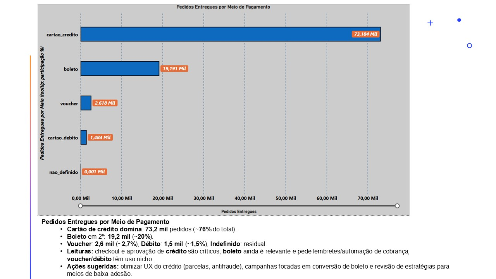
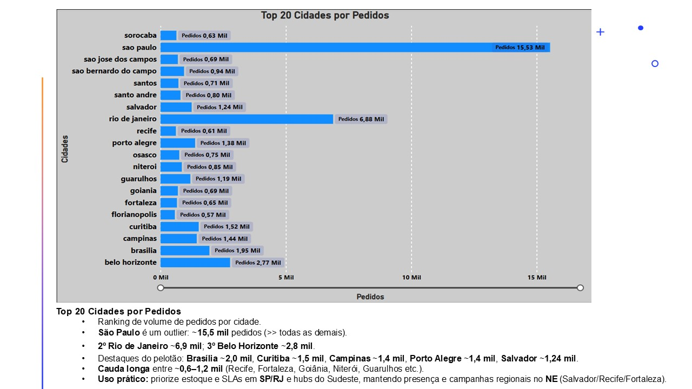
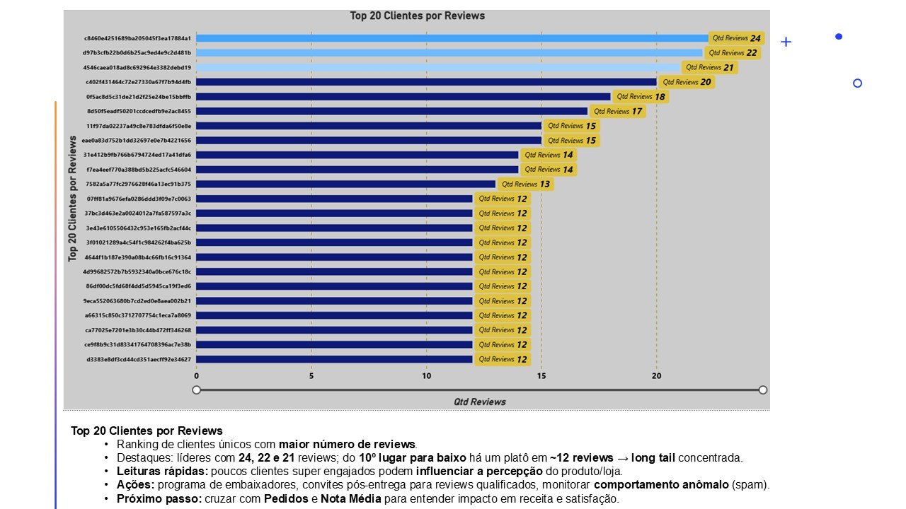

# Desafio Olist — Power BI

> Dashboard e modelagem do dataset Olist usando **Power Query**, **modelo estrela** e **DAX**.

---

## 🔎 Objetivo

Construir um painel analítico com KPIs de negócio e análises por **cidade**, **meio de pagamento** e **clientes com mais reviews** — mostrando o processo fim a fim:

**ETL (Power Query) → Modelo (estrela) → Métricas (DAX) → Visuais (Power BI).**

---

## 🗂 Estrutura do repositório

- **PBIX**: [`pbix/Estudo_Olist.pbix`](pbix/Estudo_Olist.pbix)
- **Medidas DAX**: [`dax/`](dax/)
- **Power Query (M)**:
  - Staging: [`powerquery/powerquery_staging_/`](powerquery/powerquery_staging_/)
  - Params/Funções: [`powerquery/powerquery_params_/`](powerquery/powerquery_params_/)
- **Imagens**: [`images/DESAFIO_Olist/`](images/DESAFIO_Olist/)

---

## 🏗 Modelo de dados (resumo)

**Fatos**
- `fato_pedidos_pbi` — 1 linha por **pedido**
- `fato_itens_pbi` — 1 linha por **item de pedido**
- `fato_reviews` — 1 linha por **review**

**Dimensões**
- `dim_clientes_pbi`, `dim_localidade_pbi`, `dim_produtos_pbi`, `dim_meio_pagamento_pbi`, `dim_tempo_pbi`

**Relacionamentos (principais)**
- `fato_pedidos_pbi[id_cliente]` → `dim_clientes_pbi[id_cliente]`
- `fato_pedidos_pbi[id_meio_pagamento]` → `dim_meio_pagamento_pbi[id_meio_pagamento]`
- `fato_pedidos_pbi[data_compra]` → `dim_tempo_pbi[data]`
- `dim_clientes_pbi[id_local]` → `dim_localidade_pbi[id_local]`
- `fato_itens_pbi[id_pedido]` → `fato_pedidos_pbi[id_pedido]`
- `fato_reviews[id_pedido]` → `fato_pedidos_pbi[id_pedido]`

> Observação: `receita` está em `fato_pedidos_pbi` e é base para KPIs como Ticket Médio.

---

## 📈 Principais KPIs & Métricas

Algumas medidas (todas disponíveis em [`/dax`](dax/)):

- **Pedidos** — `DISTINCTCOUNT(fato_pedidos_pbi[id_pedido])`
- **Pedidos % Total** — `DIVIDE([Pedidos], CALCULATE([Pedidos], ALL('dim_localidade_pbi'))) `
- **Pedidos Entregues** — (filtra status de entrega)
- **Pedidos MM7** — média móvel de 7 dias
- **Pedidos_Distintos** — pedidos únicos (por recorte)
- **Ticket_Médio (R$)** — `DIVIDE([receita], [Pedidos_Distintos])`
- **Rank Cidades** — ranking por número de pedidos/receita

> Sugestão: abra os `.dax` para ver a implementação e comentários de cada medida.

---

## 🔧 ETL (Power Query)

- **Staging**: cada tabela tem uma consulta `.m` em [`powerquery_staging_`](powerquery/powerquery_staging_/), com:
  - `Csv.Document(File.Contents(...))`
  - `Table.PromoteHeaders`
  - `Table.TransformColumnTypes`
  - Limpezas pontuais (ex.: `Text.Clean`, `Text.Trim`, remoção de duplicatas)

- **Parâmetros/Funções**: em [`powerquery_params_`](powerquery/powerquery_params_/):
  - `RootPath` (pasta raiz dos CSVs)
  - `fxLoadCsv` (leitura padronizada; facilita a portabilidade)

> Dica: para portar de máquina, troque apenas o `RootPath` no Power Query.

---

## ▶️ Como abrir e reproduzir

1. **Clone** este repositório ou faça download do ZIP.
2. Abra **`pbix/Estudo_Olist.pbix`** no Power BI Desktop.
3. Se os CSVs estiverem em outro caminho, ajuste o **parâmetro** `RootPath` no Power Query (Transformar dados).
4. Atualize o modelo (Refresh) e explore os visuais.

---

## 🖼 Algumas telas

- Evolução de pedidos (MM7):  
  

- Reviews por categoria de produto:  
  

- Top cidades por pedidos:  
  

---

## 📌 Roadmap (ideias)

- Publicar **docs/** com dicionário de dados e diagrama do modelo (Mermaid).
- Criar **catálogo de medidas** (README em `/dax`).
- Implantar **Deployment Pipeline** ou publicar no Power BI Service (workspace).

---

## 📬 Contato

Autor: **Douglas Souza**  
Se quiser trocar ideia sobre o projeto, abra uma *issue* ou mande uma mensagem. 🙂

